# 🏨 Hotel Booking Web Application

This is a Vue.js-based hotel booking application designed to offer a smooth and intuitive user experience for both customers and administrators. The app features account creation, room reservations, review functionality, and reservation management.

---

## ⚙️ Project Setup
Firstly clone this repository on your machine

Then Install the dependecies:

```bash
npm install
```

Compiles a:

```bash
npm run serve
```

---

## 🌐 Application Overview

### 🏁 Landing Page

The user's first contact with the application is through the **landing page**, which follows a clean and minimalist design. It features a background image, a simple heading, and a navigation bar that provides access to the rest of the site.  
This page is accessible without login or registration and acts as a digital brochure. Users can visit the **About** section to learn more about the hotel before deciding to register or book.

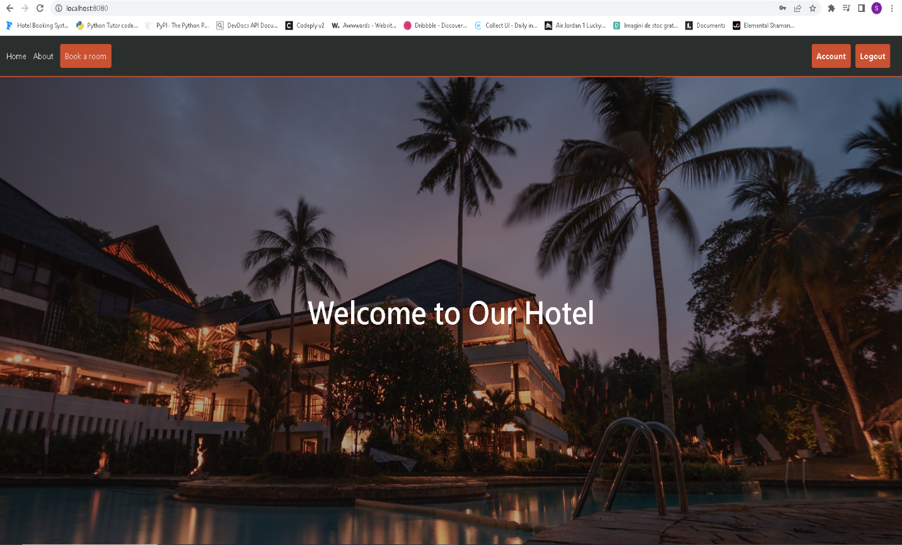

---

### ℹ️ About Page

The **About** page presents a brief description of the hotel, its amenities, and services. This information allows potential customers to make an informed decision about becoming clients.

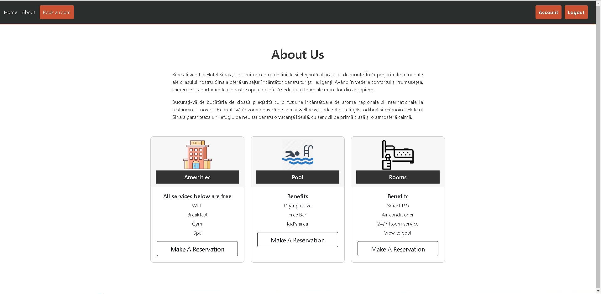

---

### 📝 User Signup

When a user decides to register, clicking **Signup** from the navbar opens the registration interface. The form includes fields for email, password, first name, and last name. After successful registration, the user is redirected to the login page.

> ⚠️ Currently, users cannot choose to create an admin account directly. Admin access is configured manually in the database.

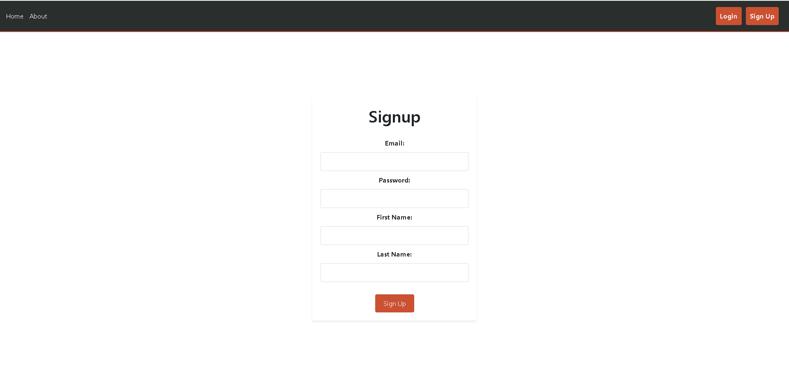

---

### 🔐 User Login

After signing up, users can log in using their account credentials.

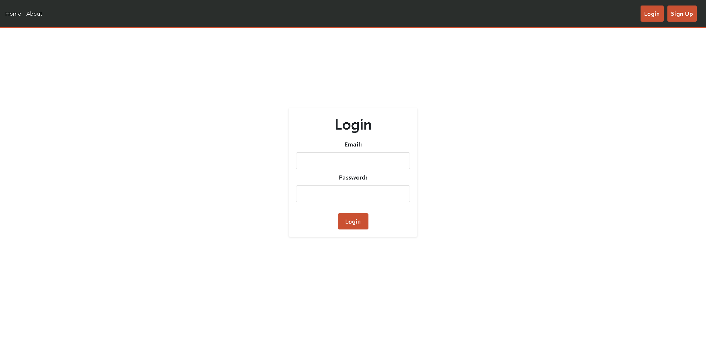

---

### 🔄 Navbar After Login

Upon login, the navigation bar dynamically changes based on the user type.

#### For Clients:
- **Account** – Displays user info and past/current reservations with an option to leave a review.
- **Book a Room** – Opens the room selection interface.
- **Logout** – Logs the user out and redirects to the landing page.

#### For Admins:
- **Account** – Displays admin info.
- **View All Reservations** – Displays the full reservation database.
- **Logout** – Logs out the administrator.

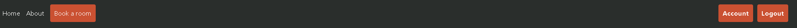

---

### 👤 Account Details

Depending on the account type, users see different data in their profile section.

| 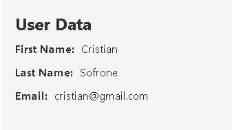 | 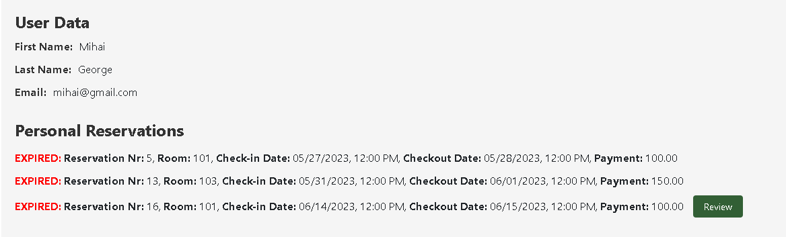 |
|:--------------------------------------------------------------:|:-----------------------------------------------------------------:|
| Admin account information                                       | Client account information and reservations                      |

---

### 📝 Submit Review

Once a reservation is completed, clients can submit a review by clicking the **Review** button. A form will appear with a textbox and a **Submit** button for sending the review.

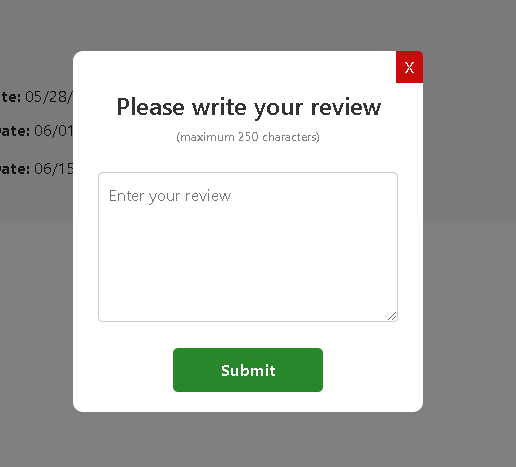

---

### 🛌 Room Selection

Clients can browse available rooms by clicking the **Book a Room** button in the navbar. Rooms are displayed in a centered card layout, each showing details and a red **Create Reservation** button. Pressing the button opens a reservation form. If a room is already booked for the selected dates, the user is notified.

| 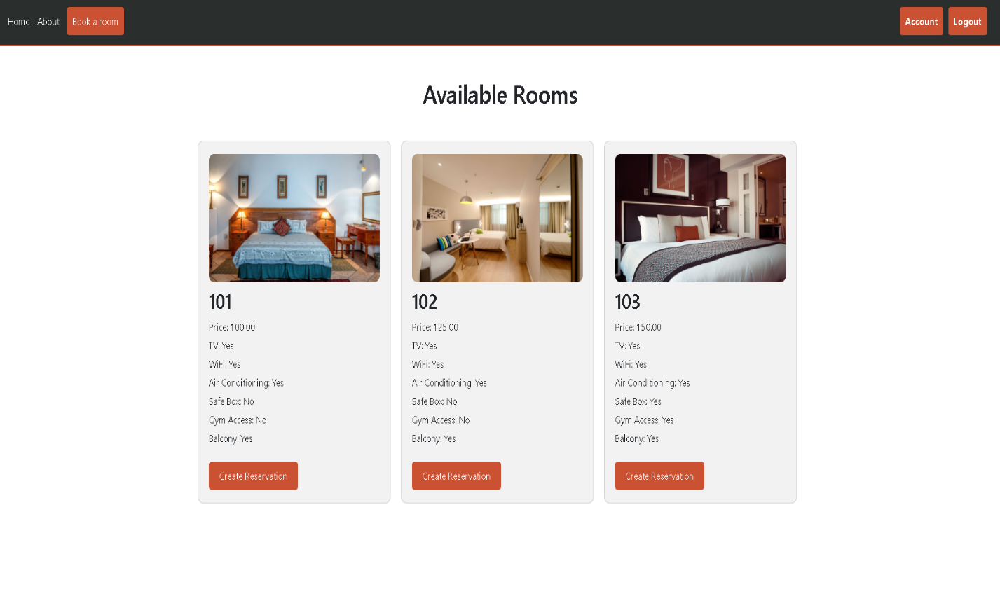 | 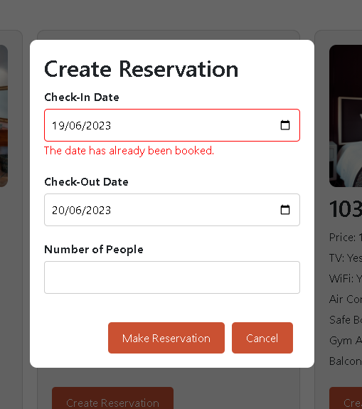 |
|:--------------------------------------------------------------:|:-----------------------------------------------------------------:|
|       View with all the available rooms                              | Reservation Form                   |

---

### 💼 Admin View: All Reservations

Admins can click **View All Reservations** to access a page listing all reservations. Each entry includes client details, room number, arrival and departure dates, price, and review (if submitted). Reservations are sorted by start date, and expired ones are marked with a red **EXPIRED** label for quick identification. Admins can delete reservations, which removes them from both the client view and the database.

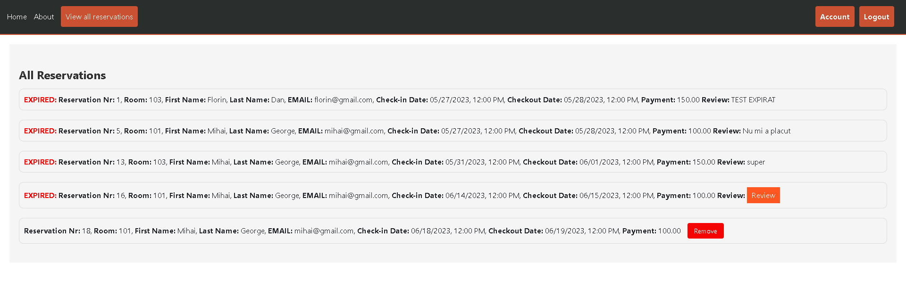

---

